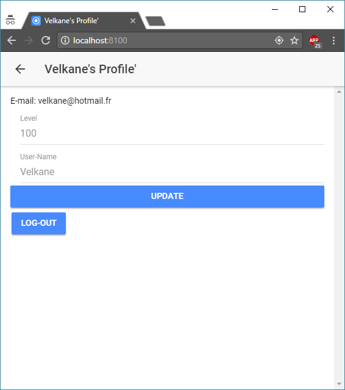

## Group composition
courtu_r (Ronan Courture) 
terran_j (Julie Terranova)

## Class attendance
We didn't attend the class (neither of us is living in Paris)

## Usage
You can either type "ionic serve" in the project folder to start the server or just download the apk

## Project constraints
Ionic 2 with Firebase 
Using geolocation 
And some backend fonctionalities as auth and data stockage

## Technical Requirements
To correctly use this application, you need :
  - Internet Connectivity
  - Authorize geolocation

## Objective of Application
Tired of people saying "I'll be there in 5 minutes" when you know perfectly that they are probably still getting ready? 
The lies are over with this application! 
This application is made for (in this instance) PokemonGo users to converge on a location at a set time for a "Raid". 
First, the user must sign-up and/or log-in to the application. Once the user is logged in, he can then access the application. Initially the view will be a map centered on the users location. 
From this page, the user can modify his profile, log out, add a "Marker" to signal an incoming event, view already created locations and re-center the map on his location if need be.

# Functionalities
Here is a list of the main functionalities of the project
### Register
To access any part of the application you need to have an account.

 
### Log in
To access any part of the application you need to be logged in.

 
### Home Page
On the home page you have a map and 4 buttons: 
- Locations (to list each location people added and are going to) 
- User Profile (to change your account level, user name or log out) 
- Add Marker (to add a location and required informations for people who want to join you for a raid) 
- Center (to center the map on your location)

 
### User Page
On the user profile page, the user can modify his userName and level in case the information needs to be updated.

 
### Locations
On the locations page, users can view the location names, and click on various locations to view more detailed information.

 
### Location
Once on a specific location page, users can signal themselve as en route to location, which then adds them to a list of users serving to display itineraries from all users coming to said location.

 
### Display Users
Display each user itineraries.

 
### Add Marker
Add where you are going and at what time (for a Pokemon user you can also add the raid boss name and the time of end).

 
